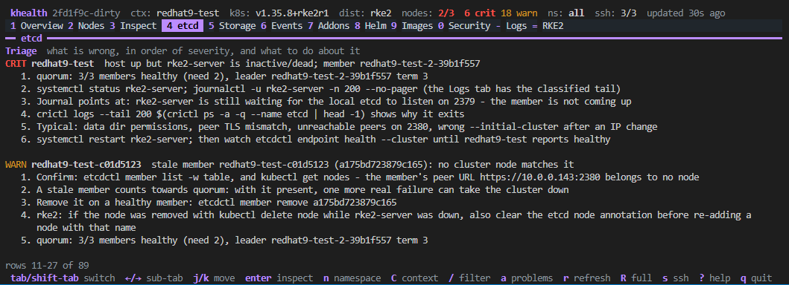

# k8s-health-tui (`khealth`)

A terminal dashboard of **health checks that k9s/kubectl don't give you**, for
upstream Kubernetes (kubeadm/kubespray) and **RKE2** clusters. It is not a
resource browser — it answers "is this cluster actually healthy, and why not?"

It uses two sources:

1. **kubeconfig** – nodes, workloads, events, storage, `/readyz`, metrics-server,
   control-plane component flags (mirror pods), kubelet `configz`, Helm release
   secrets, rke2 `HelmChart`/`ETCDSnapshotFile` objects, Rancher agents.
2. **SSH to the nodes** (optional but recommended) – live CPU/memory/load, disks
   and inodes, systemd units, NTP/clock skew, certificate expiry, sysctls and
   file permissions, `registries.yaml` vs what containerd applied, image
   inventory and airgap tarball contents, journal logs, and on control-plane
   nodes the full etcd picture: how it is configured, `/health` + `/metrics`
   with the right client certs, `etcdctl` via `crictl`, snapshots and backup
   mechanisms.

## Preview

Two short walkthroughs, one per distribution (mp4, open the link or clone
the repo to play them):

- [RKE2 cluster walkthrough](docs/media/video-preview-rke2.mp4)
  (`docs/media/video-preview-rke2.mp4`, 42 MB)
- [kubeadm (upstream Kubernetes) cluster walkthrough](docs/media/video-preview-kubeadm.mp4)
  (`docs/media/video-preview-kubeadm.mp4`, 28 MB)

The etcd tab's **Triage** block on a three-server RKE2 cluster with one server
down and one stale member, each with the numbered steps for that case (more
under [etcd triage](#etcd-triage), the repair itself under
[etcd rescue](#etcd-rescue-restore-a-snapshot)):



## Tabs

| Key | Tab | What it shows |
|-----|-----|---------------|
| 1 | Overview | cluster summary, API `readyz`/`livez`, Rancher link, ranked findings (CRIT/WARN/INFO) |
| 2 | Nodes | conditions, age, kubelet version skew, live CPU/mem/load, root + data disk %, kubelet/rke2 unit state, uptime; Enter: mounts, certs, sysctls, kubelet args, requests vs allocatable |
| 3 | Inspect | sub-tabs `Controllers` (Deployments/DaemonSets/StatefulSets/Jobs/CronJobs, then pods not owned by any of them) / `Pods` / `Resources` (every API type from discovery, built-in like Ingress/Service and CRDs, with lazy instance counts; Enter lists instances with phase/conditions) / `Object`; Enter opens the **object inspector** (owner, children, secrets, configmaps, PVCs, service account, node, typed refs in CR specs) and Enter again drills into any reference, esc goes back; `t` = rollout restart (confirmed); `L` = **tail logs** of the selected pod or a controller's pods (stream with follow, `[`/`]` switch container, `{`/`}` switch pod, `p` previous instance, `w` wrap) |
| 4 | etcd | members/health/status via **`kubectl exec` into the etcd static pod** (member list first, then endpoint health/status against every client URL, alarms) with SSH probes (curl + certs, etcdctl via crictl, gRPC gateway) as fallbacks;  members/leader/raft, per-node health, db size vs quota, fragmentation, WAL fsync + backend commit latency, alarms, **config source** (rke2 config.yaml / generated etcd config / static pod / kubeadm manifest / systemd unit), rke2 `etcd-*` settings, S3 secret, cluster snapshot records, local snapshot files, timers/crons/CronJobs; **`X` = rescue**: restore a snapshot onto the whole control plane (see below) |
| 5 | Storage | StorageClasses, CSI drivers (per-node registration), PVCs with **used capacity** (kubelet `stats/summary`) and the **backend's own health** (Longhorn robustness, healthy/wanted replicas), PVs, node filesystems (hung network mounts flagged). **Enter on a claim or volume** opens its detail: the claim (and why a Pending one waits), the PV source and attributes (secrets stripped), measured usage, every pod mounting it with the mount paths, the VolumeAttachments the controller holds (NotReady nodes, attach/detach errors), the backend's view - Longhorn engine placement, robustness, each replica with node/disk/state/rebuild, snapshots and backups; Trident backend, inherited policies and publications; Ceph pool/image and cluster health -, the volume's events of the last 2 h and the findings raised for it. Enter on a node filesystem row opens the node detail |
| 6 | Events | warning events, newest first |
| 7 | Addons | CNI (daemonsets + `/etc/cni/net.d` + rke2 `cni:`, overlay/underlay MTU per node, the node-side network probes), CSI, CoreDNS/ingress/metrics-server/…, **Rancher management** (server URL, cluster-agent, fleet-agent, provisioned vs imported, `rancher-system-agent` per node, join topology via `server:`), **registries.yaml** vs containerd `certs.d`, registries actually used by pods, **upgrade plans** (system-upgrade-controller: target, done/pending nodes, failed jobs; Enter = jobs) and, on a Rancher management cluster, the **provisioned clusters** with every machine's plan state, rke2 bundled HelmCharts + HelmChartConfig overrides |
| 8 | Helm | releases decoded from `sh.helm.release.v1` secrets (chart, version, status, revision, history); Enter: **values applied** + history; update check against the `index.yaml` of your `helm repo` list (credentials included) and `helm.repos`; `u` upgrades to the newest known version, `b` rolls back to a chosen revision (runs the `helm` CLI after a confirmation, `--read-only` disables) |
| 9 | Images | per node: image count/size, running containers, **unused images**, airgap tarballs (`/var/lib/rancher/rke2/agent/images/*.tar[.zst\|.gz]`, `.txt`) and which tarball images are running / which running images are not in any tarball |
| 0 | Security | **opt-in: nothing is evaluated or shown until `Shift+S` runs the scan** (STIG/CIS rules from the API data plus, over SSH, the node hardening and OS STIG facts). Sub-tabs `Rules` / `Node hardening` / `OS STIG`; reference releases that apply to this cluster shown in the header (the RKE2 STIG only on rke2/k3s, the Rancher MCM STIG only on the cluster that runs Rancher); **STIG / CIS** rules evaluated from apiserver/controller-manager/scheduler/etcd flags, kubelet configz, PSA labels, RBAC, privileged/host-namespace pods, plus node facts (rke2 `profile: cis`, sysctls, etcd user, file modes/ownership, SELinux, swap) and etcd content (secrets-at-rest encryption is proven by sampling a stored Secret, not just by the apiserver flag); `OS STIG` lists every rule of the DISA RHEL 8/9/10 or Ubuntu 22.04/24.04 STIG matched per node, evaluated from node facts (ComplianceAsCode templates + native checks; decision-only rules MANUAL with evidence) |
| = | RKE2 | **control-plane isolation** (taints, user pods on servers, requests vs allocatable, whether apiserver/etcd static pods carry `control-plane-resource-requests`);  `config.yaml`(.d) per node, data-dir, `server/manifests` (user vs bundled, HelmChartConfig contents), static pod manifests, audit/PSS policies, config drift between nodes |
| - | Logs | journal of rke2-server/agent, kubelet, containerd, rancher-system-agent **classified** into normal-startup noise / warnings / errors with explanations (token mismatch, CA mismatch, cluster-id mismatch, NOSPACE, PLEG, pull failures, protect-kernel-defaults, …); persistent startup noise is escalated |

Overview and etcd start with a tile row (gauges + sparklines over the last
refreshes for CPU/memory/disk/etcd db size/fragmentation/fsync, pod and
findings distribution); Nodes/Storage/Images/Security/Logs use bars and
sparklines inline. History is kept in memory for the session (90 samples).

**Node preflight** (per node, over SSH; "Preflight" table in the node detail, findings on the Overview): what stops rke2/k3s from restarting or the node from being re-provisioned although it looks healthy. Swap active or still in `/etc/fstab` (vs the kubelet's `failSwapOn`; rke2 writes `false`), fapolicyd enforcing without rules for the data-dir / `/opt/cni` / `/run/k3s` / `/var/lib/kubelet` or for the CSI host dirs (Longhorn `/var/lib/longhorn/engine-binaries`, Portworx `/opt/pwx/bin`, FlexVolume `volumeplugins`), stale `compiled.rules`, rule-file ordering vs the catch-all deny, today's `FANOTIFY` denials; auditd `admin_space_left_action`/`disk_full_action=halt|single` against the free space on the audit partition (`keep_logs` noted); `noexec` on the mount holding the data-dir or `/opt/cni`; password/account expiry and `pam_faillock` lockouts for the SSH user and root (from shadow ages, never the hash); `HTTP_PROXY` without a `NO_PROXY` covering the node IPs; on VMware VMs, `modprobe.d` disabling `cdrom`/`sr_mod`/`isofs` while cloud-init reads its NoCloud seed from `/dev/sr0` (Rancher's vSphere driver delivers user-data as an ISO), cloud-init errors, `open-vm-tools` missing; firewalld with Canal/Calico, NetworkManager without `unmanaged-devices`, `nm-cloud-setup`, iptables 1.8.0-1.8.4, SELinux enforcing without `rke2-selinux`, `ip_forward=0`, low inotify limits; and `registries.yaml`: each mirror endpoint and configs key is probed with `curl` using the configured credentials and TLS files (plus the bearer token realm), missing `ca_file`/`cert_file`/`key_file`, and configs keys that differ from the endpoint by port (credentials never sent); on heavy cycles a **`crictl pull` dry run** per registry - an image the node already holds, pulled again by digest, so containerd only resolves the manifest through the `hosts.toml` it rendered (nothing downloaded) - tells a broken rendering, a mirror that lacks the image (containerd fell through to the upstream registry) and rejected credentials apart, with the curl result of the same host as the cross-check (containerd tries the next host on any error, so the pull proves the chain and the curl probe each endpoint).

**Upgrade readiness** (Addons tab, findings under `upgrade`): kubelet vs API server skew on every node (a kubelet newer than the API server - agents upgraded before the servers - is CRIT, more than three minors behind WARN, a minority version WARN); **system-upgrade-controller plans** (`upgrade.cattle.io`, what Rancher installs for imported rke2/k3s clusters and what operators run by hand) with the nodes each plan still owes, the newest job per node and why it is stuck - image not pullable from the node (or the version has no upgrade image at all), job failed, running for over 30 minutes (drain stuck), no job scheduled for a pending node -, a channel the controller cannot resolve, a plan that skips a minor version, and nodes carrying the done label while still running the old version (rpm installs, service not restarted). On a **Rancher management cluster**, the clusters Rancher provisions (v2prov): provisioning/RKEControlPlane conditions with the planner's current step ("draining node x", "waiting for etcd"), machine phases, machines not yet on the spec version, and per machine what `rancher-system-agent` reported back through its plan secret - plan pending, failed attempts and whether the agent gave up (`failure-threshold`), failing health probes that hold further plans.

**Export** (`e` anywhere in the app; `tools/findings -json/-xlsx` headlessly): the findings (ongoing and recently resolved, with first-seen times), the security scan and the node hardening table as one JSON document and one Excel workbook - `Summary`, `Findings`, then one sheet per benchmark that was evaluated (`Kubernetes STIG`, `RKE2 STIG`, `MCM STIG`, `CIS Kubernetes`, `RHEL 9 STIG`, `Ubuntu 24.04 LTS STIG`, ... with the OS STIG rules carrying one status column per node), then `Nodes`. Coloured status cells, frozen headers, autofilter. Files are `khealth-<context>-<timestamp>.json/.xlsx` in `--export-dir` / `export.dir` (default: the current directory); nothing is re-collected, the export is what the screen shows. **`khealth --export <dir|file.json|file.xlsx>`** does it without the TUI: one collection cycle (add `--export-scan` for the security scan, `--export-heavy` for the journal/images/registry pull tiers), the files written, a one-line summary with each benchmark's score, exit - for cron, CI, or checking the report after a scan. The JSON is the same report (`findings[]`, `resolved[]`, `security.benchmarks[]` with scores and per-node outcomes, `nodes[]`), meant for diffing between runs or feeding alerting.

**Cloud provider & CSI** (Addons tab, findings under `cloud`/`storage`): which cloud-controller-manager runs (vSphere CPI, AWS, Azure, OpenStack, Harvester, or only rke2's embedded stub) and whether it initialized every node (`uninitialized` taint, providerID scheme - an `rke2://` providerID on a vSphere/AWS cluster means the stub won and the CSI cannot map the node), kubelet `--cloud-provider` vs the installed CPI, both controllers running at once; per CSI driver (vSphere, Trident, EBS/EFS, Azure, Cinder, Longhorn, NFS/SMB, Ceph, Harvester): controller and node-plugin health with crash reasons (including `FailedCreate` when PodSecurity admission rejects every pod, so no pod exists to blame), nodes missing the CSINode registration, StorageClasses/PVs, attach/mount/provision failure events of the last hour, the vSphere CPI `vsphere.conf` (vCenters, datacenters, credentials secret present). **VolumeAttachments** (every driver): a volume still attached to a NotReady node while its pod was rescheduled elsewhere (the Multi-Attach / split-brain case), StatefulSet pods stuck Terminating on a dead node with the volume, attach/detach errors the controller reports; RWX/ROX attachments are only noted. **Longhorn** from its CRs: every volume's robustness with healthy/failed/rebuilding replicas per node (faulted, degraded with why it cannot rebuild - replica count vs schedulable nodes, disk space -, unknown while attached to a down node, unscheduled volumes whose PVC is Bound anyway), RWX share-manager state, snapshot count against the volume's limit, expansion errors, single-replica volumes, engine upgrades pending, failed backups (the cause pulled out of the gRPC wrapping) and recurring backup jobs with no usable target; Longhorn nodes and disks (Ready/Schedulable with the message, missing packages, mount propagation, instance manager state, disks that do not exist or are nearly full), engine images not deployed everywhere, backup target unset or unreachable, orphaned replica directories, and the settings that bite (`default-replica-count` above the node count, rebuilds disabled, soft anti-affinity, `node-down-pod-deletion-policy`, `upgrade-checker`). **Trident** from its CRs: `TridentBackend` state and reason (offline/failed/suspended), `TridentOrchestrator` install state, `TridentBackendConfig` phase and last-operation errors, nodes without a `TridentNode` registration or with a dirty publication state, single-writer volumes published to two nodes at once, and **StorageClass resolution**: every Trident class is matched to the backends and virtual pools its parameters select (`backendType`, `storagePools`, `selector` against the pool labels, with Trident's full selector grammar) and shown with the ONTAP policies volumes inherit from those pools (snapshot, export, QoS, tiering, space/snapshot reserve - read from the backend config's non-secret keys only); a class that selects nothing, only offline backends, or that Trident never registered as a `TridentStorageClass` is a finding. **Rook-Ceph** from `cephclusters` / `cephblockpools` / `cephfilesystems` / `cephobjectstores`: the Ceph health checks with their messages, the operator phase, raw capacity, pools not Ready. Node side: AWS IMDSv2 reachable, vSphere `disk.EnableUUID` (wwn disks), vCenter SDK reachable from each node, Trident host prerequisites by backend type (iscsid, `find_multipaths no`, `mount.nfs`), Longhorn block devices a node still presents (`/dev/longhorn/*`, iSCSI sessions) for volumes the cluster has attached elsewhere or given up on - the partitioned node that keeps writing -, and network mounts that stopped answering (a hung NFS export makes `df` and every pod on it block; the probe times it out and names the mount), cloud-init unit results, `status.json`/`result.json`/`cloud-init.log` errors. Accounts: the cloud-init provisioning user (Rancher's) must not carry a password under STIG aging and must keep NOPASSWD sudo and keys; the `etcd` user must be a system account (nologin, no password) owning the etcd data dir.

**CNI / overlay network** (Addons tab CNI section and node detail, findings under `network`): every light probe reads the interfaces (`ip -o link`), the default route's device and flannel's `subnet.env`, so the overlay MTU (`flannel.1`, `flannel-wg`, `vxlan.calico`, `tunl0`, `cilium_vxlan`, ...) is checked against the underlay minus the encapsulation overhead (VXLAN 50, WireGuard 60-80, IPIP 20), across nodes, and against the `mtu` in the CNI conflist; a tunnel that is DOWN is a finding. From the API: a `NetworkUnavailable` condition that cleared in the last hour, CNI agent pods that restart. With the config tier (first contact, `R`, heavy cycles) each node runs active probes - a `ping` to one pod on every other node (the overlay path: cni bridge, VXLAN/WireGuard/IPIP to the far node, its pod), a DNS query to each CoreDNS pod and to the DNS service ClusterIP, a TCP connect to the `kubernetes` service ClusterIP - all in parallel, capped at a few seconds, targets taken from the snapshot; nothing is created in the cluster and no RBAC beyond listing services is needed. Which probes fail together names the fault: every ping fails = this node's overlay or the tunnel port on the host firewall; one ping fails = that one path (MTU, firewall one way); CoreDNS pods answer but the service does not = kube-proxy (iptables vs nftables backend on RHEL 9); the `kubernetes` service fails while DNS works = 6443 to the control plane blocked from the node.

**Distributions**: rke2, k3s and kubeadm/upstream (kubeadm detected from the
`kubeadm-config` ConfigMap or the `kube-apiserver-<node>` static pods; EKS,
GKE, AKS, RKE1, OpenShift, MicroK8s, k0s and Talos are named). Every hint and
tab reads in the distribution's own words through [internal/distro](internal/distro/distro.go):
units, config files, data dirs, restart / certificate-renewal / cloud-provider
/ kubelet-setting commands. On kubeadm the Config tab shows the
`ClusterConfiguration`, the cluster `kubelet-config`, and per node the
KubeletConfiguration (`/var/lib/kubelet/config.yaml`, `kubeadm-flags.env`,
systemd drop-ins), static pod manifests and drift of the kubelet settings
across nodes.

**Node hardening** (per node, over SSH): SELinux runtime vs `/etc/selinux/config`, AppArmor, FIPS (`/proc/sys/crypto/fips_enabled` vs `fips=1` in grub / Ubuntu Pro), fapolicyd, auditd (+ rule count), firewalld/ufw (runtime vs unit-file / `ufw.conf`), Secure Boot, kernel lockdown, crypto policy, pending reboot. Runtime/boot mismatches are findings. The node detail (Enter on Nodes) opens with a dashboard of gauges and this table.

Keys: `Tab`/`Shift+Tab` (or `[`/`]`, number keys) switch tabs, `←`/`→` or `h`/`l` switch sub-tabs inside a tab, `j/k` move, `Enter` detail, `n` namespace,
`/` filter, `a` problems-only, `m` hide manual STIG rules, `r` refresh, `R` full refresh (logs/images), `Shift+S` security scan (Security tab),
`s` toggle SSH, `P` footprint (what khealth itself costs), `e` export findings + security scan as JSON and XLSX, `w` wrap long lines in a detail view, `?` help, `q` quit.

## Install / build

No Go on the machine? Use Docker:

```sh
./build.sh linux amd64      # -> dist/khealth-linux-amd64
./build.sh windows amd64    # -> dist/khealth-windows-amd64.exe
./build.sh darwin arm64
```

With Go 1.26+: `go build -o khealth ./cmd/khealth` (or `make build`, `make test`).

## Run

```sh
khealth                                   # current kubeconfig context, SSH as $USER with agent/default keys
khealth --context prod --ssh-user ubuntu --ssh-key ~/.ssh/prod.pem
khealth --no-ssh                          # API-only view
khealth --bastion jump@bastion.example.com --insecure-host-key
khealth --helm-updates=false              # skip the chart update check (on by default from your `helm repo` list and helm.repos)
khealth --ssh-user admin --ask-pass       # prompt for a password used when keys fail (and for sudo)
khealth root@10.0.0.11                   # no kubeconfig yet: fetch the admin kubeconfig over SSH from a server node (below)
khealth --export ./reports --export-scan  # no TUI: one collection cycle + the security scan, JSON + XLSX written, exit
```

### No kubeconfig, but SSH to the nodes

`khealth [user@]server-node` (or `--bootstrap-kubeconfig <server>[,<server>...]`) fetches the admin kubeconfig
(`rke2.yaml` / `k3s.yaml` / `admin.conf`) from the first reachable server node
and rewrites `server: https://127.0.0.1:6443` to an endpoint the apiserver
certificate is actually valid for. Candidates come from the serving
certificate's SANs, ranked from the operator's side: a DNS name that resolves
to a VIP / load-balancer address first, then a bare VIP, then the node's own
name or address, and the SSH host as a last resort (with a warning and the
`tls-san:` line to add). Each candidate is verified against `/version` before
it is written. The cluster, user and context are named after the cluster
(`--bootstrap-name`, else the first label of the endpoint's DNS name, else
the node hostname without its index) instead of rke2's `default`, so several
bootstrapped files merge cleanly for context switching. The file goes to
`~/.kube/khealth-<name>.yaml` (`--bootstrap-out` to change; an existing file
is kept as `.bak`) and the TUI starts with it. When the configured kubeconfig
does not load and `ssh.hosts` lists nodes, khealth offers the same thing
interactively. `tls-san` entries in `config.yaml` that the certificate does
not carry yet are reported: rke2/k3s only reissue the certificate on restart.
The same works for upstream kubeadm clusters (`admin.conf`, `pki/apiserver.crt`,
`apiServer.certSANs` in `kubeadm-config`; `kubeadm certs renew apiserver`
reissues) and for k3s (`k3s.yaml`, `systemctl restart k3s`).

The RKE2 tab (labeled **Config** on non-rke2/k3s clusters) shows the same
comparison live: the kubeconfig server (VIP vs single node), each control-plane
node's configured SANs (`tls-san`, or kubeadm `certSANs` + `controlPlaneEndpoint`)
against its serving certificate, and whether the kubeconfig host is in the
certificate; mismatches are also Overview findings.

`khealth --init-config` writes the annotated example config to
`~/.config/k8s-health-tui/config.yaml` (`%AppData%/k8s-health-tui/config.yaml`
on Windows; `--config <path>` to put it elsewhere; it never overwrites) and
`--print-config` prints it to stdout. `./k8s-health-tui.yaml` and
`./khealth.yaml` in the working directory are also picked up. Every key is
optional; flags override the file. The source of the example is
`internal/config/config.example.yaml`.

Run `khealth` with nothing else and it lists the clusters it knows (the
kubeconfig in use plus every `~/.kube/khealth-*.yaml`) as a numbered menu,
with `n` to bootstrap another from `[user@]host`. Each bootstrapped context
remembers how its nodes were reached - `ssh-user`, `ssh-key`, `ssh-port`,
`become` and the bootstrap host, stored as a `khealth` extension on the
context, never a password - and both the menu and `C` re-apply it, so a
cluster reached as `root` and one reached as `ubuntu` need no flags. Flags
typed on the command line still win; picking a file that predates this
remembers the current `--ssh-user` in it.

`C` inside the app opens a context picker: the contexts of the kubeconfig in
use plus every `~/.kube/khealth-*.yaml`, so each cluster bootstrapped once is
one keypress away; switching drops all cached results and starts a fresh
first-contact cycle.

A file bootstrapped earlier is reused while it still connects: matched by
server host before any SSH, or by the cluster CA once the admin kubeconfig is
fetched. A stale one (endpoint no longer answers) is replaced in place with a
`.bak`; `--bootstrap-fresh` skips the reuse.

Started with no usable kubeconfig and no host, khealth asks instead of failing:
on a cluster node it offers the local `rke2.yaml` / `k3s.yaml` / `admin.conf`
(copied through `sudo` into `~/.kube/khealth-local.yaml` when it is root-only);
otherwise it asks for a server node (`[user@]host`, password prompt when there
is no key or agent) and bootstraps from it. `--ssh-address` is the node address
*type* (InternalIP / ExternalIP / Hostname) used for nodes listed by the API,
not a host.

### What SSH needs on the nodes

* a login that can become root: root itself, or a user with `sudo`, `dzdo`
  (Centrify / Delinea) or `doas`. Each host is probed once (`become: auto`
  tries them in that order) and the first that works is cached: NOPASSWD is
  used when granted; otherwise the password is fed on stdin for `sudo` and
  `dzdo` (`doas` has no such mode and needs `nopass`). Pin a tool with
  `become: dzdo` / `--become dzdo`. The collection script is POSIX `sh` sent
  over stdin, no files are written on the node
* standard tools: `df`, `stat`, `systemctl`, `journalctl`, `openssl`, `curl`
  (etcd health/metrics), `sysctl`; `crictl` is found automatically
  (`/var/lib/rancher/rke2/bin/crictl` on rke2), `zstd` only to read `.tar.zst`
  manifests
* host keys must be in `~/.ssh/known_hosts` unless `strict_host_key: false`
* auth order: ssh-agent (incl. Windows OpenSSH agent) -> key file(s) ->
  password fallback. The password comes from `--ask-pass` (prompted, not
  echoed), `KHT_SSH_PASSWORD`, `ssh.password` in the config or `--ssh-password`;
  it is also used for keyboard-interactive auth and, unless
  `ssh.become_password` / `KHT_BECOME_PASSWORD` is set, for `sudo -S` /
  `dzdo -S` when NOPASSWD is not granted. Encrypted keys: `KHT_SSH_PASSPHRASE`.

Light collection runs every refresh (default 30s, ~0.2s wall / 0.2s CPU per
node, parallel). The expensive tiers follow the visible tab
([docs/ARCHITECTURE.md](docs/ARCHITECTURE.md) §7): the journal is collected
while the Logs tab is open (and hourly in the background for the log
findings), the image inventories and registry pull dry run while Images or
Addons is open, the `du` of hostPath PVs while Storage is open, the config
tier (certificates, sysctls, file modes, rke2/k3s config, manifests,
registries, slow hardening commands) on first contact and while RKE2 or
Security is open - each refreshed every `heavy_every` refreshes while its
tab stays open, fired at once when the tab is opened with stale facts,
carried forward in between, and always shown with its age. `R` runs every
tier on every node; `collect.always` pins tiers to every tab.
Tarball manifests are cached by path/size/mtime so large `.tar.zst` files
are only read once. The Security tab is opt-in: the STIG/CIS rules are not
evaluated and the OS STIG facts (`sysctl -a`, package lists, `find` scans,
config dumps) are not collected until you press `Shift+S` there; later cycles
reuse the facts until the next `Shift+S`.
[docs/REFRESH.md](docs/REFRESH.md) lists every remote call and its cadence;
[docs/ARCHITECTURE.md](docs/ARCHITECTURE.md) describes the update loop, the
tick, what a screen costs and the tab-driven collection (§7).

The tool is meant to be run against clusters that are already in trouble,
so it measures and minimizes its own footprint: probes run under
`renice`/`ionice`, API lists come from the apiserver watch cache in
protobuf (no etcd quorum reads), a node whose probe is slow or still
running is skipped rather than stacked, and `P` shows what the last cycles
cost the API server, every node (remote CPU seconds per probe) and this
host. `--perf-log file.jsonl` records it per cycle and
`tools/perfbench` measures it headlessly with baseline-vs-during CPU
sampling on the nodes. See [docs/PERFORMANCE.md](docs/PERFORMANCE.md).

### RBAC needed (read-only)

list/get on nodes, pods, namespaces, events, persistentvolumes(-claims),
storageclasses, csidrivers, csinodes, deployments, daemonsets, statefulsets,
jobs, cronjobs, clusterrolebindings, networkpolicies, secrets (Helm releases +
rke2 S3 config), configmaps, `etcdsnapshotfiles.k3s.cattle.io`,
`helmcharts/helmchartconfigs.helm.cattle.io`, `nodes/proxy` (kubelet configz),
`/readyz` `/livez` (`nonResourceURLs`), `metrics.k8s.io`. Missing permissions
degrade gracefully and show up as findings.

## etcd triage

When a member is unhealthy the etcd tab and the Overview findings carry a
**Triage** block: one entry per problem member, classified by correlating the
member list / endpoint health with the node's Ready condition, SSH
reachability, `rke2-server`/`k3s`/`kubelet` service state, the etcd static
pod's container status and the classified journal (cluster-id mismatch,
NOSPACE, disk full, missing etcd user, expired certs, port in use, clock
skew). Each entry states the quorum situation (healthy/needed, leader, term)
and numbered steps for that case. Nothing is executed; mutating commands
(`member remove`, `defrag`, `alarm disarm`, `--cluster-reset`) are printed.

When quorum is lost (power outage, all members down) the probe also reads
what is on disk on each node: the etcd container log
(`/var/log/pods/kube-system_etcd-*/etcd/*.log`, journal for k3s/systemd
etcd) for `elected leader ... at term N` lines and the node's own
`local-member-id`, plus `member/snap/<term>-<index>.snap` and the newest WAL
file. Nodes are ranked by the highest term at which they were leader, then
snapshot term/index and WAL activity, and the cluster finding names the node
to run `--cluster-reset` on. If the apiserver itself is unreachable the SSH
collection keeps going against the last node list it saw (or `ssh.hosts`)
and runs the etcd probe on every host. When the kubeconfig's server does
not answer at all, khealth tries the apiserver of the other control-plane
nodes it knows (peers found on disk by the etcd probes, healthy members
first; the last node list; `ssh.hosts`) with the same kubeconfig CA and
credentials, and switches to the first that answers (`api ... (failover)`
in the header). Dials time out after 5 s so a dead host does not stall the
cycle. `khealth user@server-node` still starts when the API server is down:
the bootstrap writes a kubeconfig pointing at that node with a note, the
TUI comes up offline and the node is the SSH target.

## etcd rescue (restore a snapshot)

Every step, command and check is listed in [docs/RESCUE.md](docs/RESCUE.md).
Live-tested on three-server
rke2 (RHEL 9 STIG, `profile: cis`) and three-node kubeadm (Ubuntu 24.04
STIG) control planes: restore from any server, rejoin of a broken server
(details and what was learned in the *Tested* section of that document).

`X` on the etcd tab repairs the control plane over SSH (needs SSH
collection on, `actions.enabled`, and an rke2, k3s or kubeadm control
plane). It first asks which situation you are in, and recommends one from
what it sees:

- **quorum is fine, one member is broken** -> *rejoin one server*: that
  server is stopped, its etcd data moved aside (kept), its stale member
  entry removed from the surviving cluster and it rejoins through the
  healthy leader (rke2/k3s: temporary `server:` + token drop-in; kubeadm:
  learner add, manifest patch, promote). Nothing else is touched, nothing
  written since is lost. Takes about half a minute.
- **quorum is lost or the data is bad** -> *restore a snapshot*, below.

With the apiserver down khealth still knows the whole control plane: the
etcd probe reads the cluster's members from the reachable node's disk (the
`members` bucket of `member/snap/db`, the `initial-cluster` of the generated
config or the static pod manifest) and from the etcd log which member id
led at which term, and probes every peer over its peer address. The picker
shows each node's member name/id, the live leader or the *last leader*
(highest election term in any log), on-disk raft position and snapshots.

The restore walks through:

1. **node**: the etcd nodes with state, role, the last election term their
   log saw and their snapshots; the best restore source is preselected (an
   online healthy leader, then the freshest raft state);
2. **restore point**: that node's snapshot files, newest first (S3 records
   too on rke2/k3s when `etcd-s3-*` is inline in `config.yaml`; a config
   secret cannot be read while the apiserver is down);
3. **preflight** (read-only) on every server: binary, data dir owner/mode
   and size, free space, mount point, `reset-flag`, `server:`/`cluster-init`,
   kubeadm manifest (`--name`, peer URL, image), restore tools, the
   snapshot itself. An unreachable follower is left out with a warning;
4. **confirmation**: the plan, the warnings and a typed `restore`;
5. the steps, live, with an etcd member/health/leader check after every
   node. `esc` hides the view (the rescue continues), `x` aborts after the
   step in progress.

What it does, per the projects' documented procedures:

| | rke2 / k3s | kubeadm |
|---|---|---|
| stop | `systemctl stop rke2-server`/`k3s` on every server, followers first; the etcd process the unit leaves behind (it kills containerd, not the containers) is stopped too, so no stale member serves the old membership during the reset | park `etcd.yaml` and `kube-apiserver.yaml` out of `/etc/kubernetes/manifests` |
| keep | every node's `server/db/etcd` moved to `server/etcd-rescue-<time>/` (never deleted by khealth) | `/var/lib/etcd` moved to `/var/lib/etcd-rescue-<time>/` |
| restore | `rke2 server --cluster-reset --cluster-reset-restore-path=<snapshot> --etcd-s3=false` on the target (plus `--server=` when its config has a join URL, which rke2 otherwise refuses), as a transient systemd unit (`systemd-run`), polled until it prints *membership has been reset*; then verified on disk (old dir renamed to `etcd-old-<time>`, `member/snap/db` + WAL rewritten after the reset, the reset log says *restored snapshot*) - if not, the dir is moved aside and the restore runs once more | `etcdutl snapshot restore` as a one-member cluster: host `etcdutl`/`etcdctl`, else the pod's etcd image through `ctr`/`podman` |
| perms | previous owner re-applied (`etcd:etcd` under `profile: cis`), `0700`, `restorecon -RF` on SELinux hosts | same |
| start | `systemctl start`; wait for etcd, then `/readyz`. If the member list still shows the old peers, or no leader appears within 5 minutes, the known rke2 fix runs by itself: stop, a plain second `cluster-reset`, start, wait again. Then the CNI agent pod on the node is restarted: calico-node resyncs against the apiserver while it is still coming up and drops the routes to the pods already running there ("no route to host" from every pod on the node until it is restarted) | etcd manifest back; wait; apiserver manifest back; controller-manager, scheduler and kubelet restarted |
| rejoin | one follower at a time: start with a temporary drop-in (`server:` pointing at the target, plus the cluster token from `server/token` when the config has none - the `cluster-init` node never had one there and would otherwise found a new cluster; removed once it is a member), wait until it is a healthy voting member | `member add --learner`, patch its manifest (`--initial-cluster`, `state=existing`), start, promote once synced, apiserver back |
| after | verify (all members healthy, one leader, no alarms, apiserver up), fresh snapshot | same |

Running the restore as a transient systemd unit matters on SELinux hosts:
a command started from an SSH session is `unconfined_u`, every file it
writes carries that user, and the confined etcd container is denied its own
data dir - rke2's cluster-reset then waits 15 minutes for an etcd that
never comes up.

## etcd S3 snapshots

For rke2/k3s the tool works out the effective S3 destination of every
server: `etcd-s3-*` keys from `config.yaml`(.d) (credential values are
reported as `<set>`, never read) merged with the `etcd-s3-config-secret` when
one is named (its values win). It then reports: S3 enabled on some servers but
not others, servers uploading to different endpoint/bucket/folder, missing
bucket or credentials, `skip-ssl-verify`, the secret not existing, the newest
S3-uploaded snapshot record being older than `etcd.max_backup_age`, records
whose upload failed, `s3-upload-fail` journal lines, and whether each server
can actually reach the endpoint: a `curl` from the node using the node's own
CA / TLS settings (any HTTP status counts as reachable; DNS, connect and
certificate errors are shown verbatim). No credentials are used for that
check. The etcd tab shows one row per server.

## How etcd is discovered

| Layout | Detection | Certs | etcdctl | Snapshots |
|--------|-----------|-------|---------|-----------|
| rke2 | `/var/lib/rancher/rke2/server/tls/etcd` | `server-ca.crt`, `server-client.crt/key` | `crictl exec` into the `etcd` container | `/var/lib/rancher/rke2/server/db/snapshots`, `ETCDSnapshotFile` CRs, `rke2-etcd-snapshots` ConfigMap, `etcd-s3-config-secret` |
| k3s | `/var/lib/rancher/k3s/server/tls/etcd` | same | curl only (embedded) | `/var/lib/rancher/k3s/server/db/snapshots` |
| kubeadm | `/etc/kubernetes/pki/etcd` | `ca.crt`, `healthcheck-client.*` or `apiserver-etcd-client.*` | `crictl exec` (containerd/cri-o) or host `etcdctl` | `etcd.backup_dirs`, common dirs, systemd timers, crons, CronJobs named *etcd* |
| kubespray/systemd | `/etc/ssl/etcd/ssl/ca.pem` | `admin-<host>.pem` | host `etcdctl` | same |

Config sources listed on the etcd tab: rke2 `config.yaml`(.d) `etcd-*` keys,
the rke2-generated `/var/lib/rancher/rke2/server/db/etcd/config`, static pod
manifests (`pod-manifests/etcd.yaml`, `/etc/kubernetes/manifests/etcd.yaml`),
`/etc/etcd/*`, `/etc/default/etcd`, `systemctl cat etcd`, and the
`--etcd-servers` the apiserver points to (external etcd). Override endpoint and
cert paths in `etcd:` when your layout differs.

## Security / STIG notes

The Security tab automates the checks that can be verified from configuration
and API state. Rule IDs come from the XCCDF of these releases, downloaded from
`https://dl.dod.cyber.mil/wp-content/uploads/stigs/zip/` (DISA) and the CIS
benchmark numbering:

| Reference | Release | IDs |
|---|---|---|
| DISA Kubernetes STIG | V2R6 (01 Apr 2026) | `V-2423xx`..`V-2424xx`, `V-2455xx`, `V-2548xx`, `V-2748xx` |
| DISA Rancher Government RKE2 STIG | V2R7 (01 Jul 2026) | `V-2545xx`; `RKE2-*` for hardening-guide prerequisites the STIG does not number |
| DISA Rancher Government MCM STIG | V2R2 (05 Jan 2026) | `V-2528xx`, `V-257292`; only on the cluster that runs Rancher (auth provider, `AUDIT_LEVEL`, new-user default role, single local admin, ingress 443 + NetworkPolicies to 444, `privateCA`/`ingress.tls.source=secret` from helm values) |
| CIS Kubernetes Benchmark | v2.0.1 (Jun 2026) / rke2 self-assessment v1.12 | `CIS-x.y.z` |
| DISA RHEL STIG | 8 V2R8, 9 V2R9, 10 V1R2 (01 Jul 2026) | per node, matched from `/etc/os-release` |
| DISA Ubuntu LTS STIG | 22.04 V2R9, 24.04 V1R6 | per node, matched from `/etc/os-release` (20.04 is out of standard support and not covered) |

**Scores.** Both Security sub-tabs show an SCC / OpenSCAP-style scorecard
per benchmark (and per node on the OS STIG sub-tab): score = Not a Finding
÷ (Not a Finding + Open) - the XCCDF default scoring model DISA content
uses, where every rule has equal weight and Not Applicable / Not Reviewed
rules are excluded from the denominator - plus the Open / Not a Finding /
N/A / Not Reviewed counts and open-per-CAT (I/II/III), so the numbers line
up with what SCC prints for the same STIG. MANUAL results are Not
Reviewed: they lower nothing, but the count is shown so nobody mistakes a
partially reviewed 100% for a complete one.

**Running the OS STIG.** The OS STIG collection is heavier than the normal
probes (`sysctl -a`, package lists, `auditctl -l`, `sshd -T`, a `find` sweep
over the local filesystems and ~60 config-file dumps - a few seconds of CPU
per node), so it never runs on its own: not at launch, not on `r`/`R`, not
when SSH is re-enabled. Go to the **Security** tab and press **`Shift+S`**;
the tab shows a checklist with each node's progress through the four
collection stages (system facts, file modes, accounts, filesystem sweep;
a few seconds each) and the header the overall percent (`scan 58% 1/3 nodes`),
the results appear when the last node answers, and the OS STIG header shows how old the facts
are. Later refresh cycles carry the facts forward; press `Shift+S` again to
re-collect (for example after remediation). Until the first scan the whole
tab shows only the opt-in notice; without SSH the scan evaluates the API-side
rules only and every sub-tab says so.

The OS STIGs are evaluated in full: every rule of the matched release is
listed on the `OS STIG` sub-tab. Checks come from [ComplianceAsCode](https://github.com/ComplianceAsCode/content)
templates (sysctl, packages, services, mounts, `sshd -T`, file modes and
owners, audit rules, kernel modules, grub arguments, pwquality/faillock,
config-file values) joined to the DISA XCCDF by STIG ID and embedded as
generated tables (`internal/stigdata/data`), plus native evaluators for the
rules ComplianceAsCode checks with hand-written OVAL (account database,
PAM/sudo/login.defs, audit and rsyslog configuration, crypto policy, boot
loader, a filesystem sweep, ...). Every rule of RHEL 8/9/10 and Ubuntu
22.04/24.04 that ComplianceAsCode maps is evaluated (98-100%); results that
need an organizational decision are MANUAL with the evidence and the STIG's
own check text in the detail view. RHEL rebuilds (Rocky, Alma, CentOS Stream, Oracle)
use the RHEL STIG of the same major; other distributions fall back to generic
`OS-*` IDs. `Node hardening` keeps the per-node runtime/boot facts and a
pass/fail summary column. See [docs/STIG.md](docs/STIG.md) for sources,
generation and how to add rules.

The mapping is best-effort: verify it against the release you are audited
against and treat `MANUAL` results as items to review. Secrets, tokens and
passwords are masked before any file content leaves the node.

## Support matrix

*Tested* = exercised against a live cluster in the lab (what those clusters
are is under each table). *Supported* = the code paths and unit tests exist,
built from the API/CRD schemas or the vendor's documented layout, but no
live cluster of that kind has run through it yet - expect rough edges and
report them. Nothing else is claimed.

The lab: rke2 v1.34 single node (Rocky Linux 9.7, Rancher v2.13 management
cluster, Harbor registry, csi-driver-nfs, local-path), rke2 v1.35 three-server
control plane (RHEL 9.6, DISA STIG + FIPS, fapolicyd, `profile: cis`,
Longhorn), kubeadm v1.35 three-node stacked-etcd control plane (Ubuntu 24.04
LTS, DISA STIG); Canal on all three. The operator host is Windows; Linux
binaries are built the same way but exercised less.

### Kubernetes distributions

| Distribution | Status | Notes |
|---|---|---|
| RKE2 | tested | v1.34-v1.35, single node and 3-server, `profile: cis` |
| kubeadm / upstream | tested | v1.35, 3-node stacked etcd (containerd); the Config tab and kubeadm cert/SAN checks |
| k3s | supported | same code paths as rke2 (data-dir, `k3s.yaml`, `k3s crictl`, embedded etcd); no k3s cluster in the lab |
| Rancher management cluster | tested | Rancher v2.13 on rke2: MCM STIG rules, local users/auth providers, provisioned-cluster listing |
| Rancher-managed (imported) cluster | supported | cattle-cluster-agent, fleet-agent, system-upgrade-controller plans; the Rancher-side views were exercised on the management cluster only |
| Rancher-provisioned (v2prov) cluster | supported | machine plans / RKEControlPlane conditions are read from the management cluster; built from the planner's secret layout, unit-tested, no downstream cluster in the lab |

### Node operating systems

| OS | Status | Notes |
|---|---|---|
| RHEL 9 (and Rocky / Alma / CentOS Stream / Oracle 9) | tested | preflight, hardening table, DISA RHEL 9 STIG V2R9 (445 rules), FIPS, fapolicyd, SELinux enforcing |
| Ubuntu 24.04 LTS | tested | preflight, hardening table, DISA Ubuntu 24.04 STIG, ufw, AppArmor, unattended-upgrades |
| RHEL 8, RHEL 10 | supported | DISA STIG tables generated the same way as RHEL 9; not run on a node |
| Ubuntu 22.04 LTS | supported | DISA STIG table present; not run on a node |
| SLES / SLE Micro, Flatcar, others | supported | the generic checks (preflight, hardening, `OS-*` rules); no DISA table, so the OS STIG sub-tab is empty |

### CNI

| CNI | Status | Notes |
|---|---|---|
| Canal | tested | overlay/underlay MTU, node-side pod / DNS / service probes |
| Calico, Cilium, Flannel, Multus | supported | detection, interface MTU and the node-side probes are CNI-agnostic; not run with these in the lab |

### Storage / CSI

| Driver | Status | Notes |
|---|---|---|
| Longhorn | tested | volumes, replicas, engines, nodes/disks, instance managers, backups, orphans, settings, node-side devices; chaos-tested (node partitions, replica and instance-manager loss, hung RWX exports, backup failures) |
| local-path-provisioner / hostPath | tested | PV `du` on the nodes, hung mounts |
| csi-driver-nfs / SMB | tested (nfs) | the generic controller / node-plugin / attachment checks; hung-mount detection was exercised with Longhorn RWX exports |
| NetApp Trident | supported | backends, pools, policies, TridentNode registrations from the CRDs; node prerequisites (iscsid, multipath, mount.nfs); unit-tested from the CRD schemas, no ONTAP in the lab |
| Rook-Ceph | supported | cluster/OSD health from the CRDs; unit-tested only |
| vSphere CNS, AWS EBS/EFS, Azure Disk/File, OpenStack Cinder, Harvester, Portworx | supported | generic controller / node-plugin / CSINode / VolumeAttachment checks and the cloud-provider checks; not run in the lab (KVM) |

### Cloud providers

| Provider | Status | Notes |
|---|---|---|
| none / rke2 embedded stub | tested | providerID scheme, `uninitialized` taint |
| vSphere CPI, AWS, Azure, OpenStack, Harvester | supported | which CCM runs, node initialization, `vsphere.conf`, IMDS/vCenter reachability from the nodes; no such cluster in the lab |

### Major features

| Feature | Status | Notes |
|---|---|---|
| Health findings, node preflight, log classification | tested | all three lab clusters, continuously |
| Bootstrap a kubeconfig over SSH (`khealth user@node`) | tested | rke2 and kubeadm servers, VIP/SAN ranking |
| etcd triage (quorum, leader, latency, member vs node reconciliation) | tested | rke2 and kubeadm; exec-based member view and the SSH fallbacks |
| etcd rescue - rejoin one broken server | tested | rke2 3-server (RHEL 9 STIG) and kubeadm 3-node (Ubuntu STIG): stop, move data aside, member remove/add, rejoin, CNI restart, endpoint check |
| etcd rescue - restore a snapshot, single node | tested | rke2 single server and kubeadm single node |
| etcd rescue - restore a snapshot, whole control plane | tested | rke2 3-server (`cluster-reset`, VIP + shared token pre-flight) and kubeadm 3-node, restored from any of the servers |
| etcd rescue on k3s | supported | same steps as rke2 with the k3s paths; not run |
| etcd S3 snapshot configuration and endpoint reachability | supported | rke2 `etcd-s3` settings, secret, endpoint probe from the etcd nodes; unit-tested, no S3 target in the lab |
| Security scan: Kubernetes STIG, RKE2 STIG, CIS | tested | rke2 and kubeadm clusters |
| Security scan: Rancher MCM STIG | tested | Rancher v2.13 management cluster |
| Security scan: OS STIG collection over SSH | tested | RHEL 9 (STIG/FIPS/fapolicyd) and Ubuntu 24.04, four stages per node |
| Registry probes (`registries.yaml` curl + `crictl pull` dry run) | tested | Harbor (token auth, `insecure_skip_verify`), hand-rendered `hosts.toml` failure paths on containerd 2.x |
| Upgrade readiness: system-upgrade-controller plans | tested | SUC v0.20 on rke2: unpullable image, missing version, skipped minor, unresolvable channel, completed plan |
| Upgrade readiness: Rancher provisioned-cluster machine plans | supported | unit-tested against the planner's secret layout |
| Helm actions (`u` upgrade, `b` rollback) | supported | run the `helm` CLI after a confirmation; the overlays and command lines are unit-tested, a live upgrade/rollback has not been run from khealth in the lab |
| Export (`e`, `--export`, JSON + XLSX) | tested | the RHEL 9 cluster with the full STIG scan (five benchmarks, 445 OS rules with per-node columns), the Rancher cluster with `--no-ssh` |
| Footprint measurement (`P`, `--perf-log`, `tools/perfbench`) | tested | baseline in [docs/PERFORMANCE.md](docs/PERFORMANCE.md) |

## Layout

```
cmd/khealth            entry point
internal/config        defaults, YAML file, flags
internal/k8s           client-go snapshot, Helm decoding, helpers
internal/sshrun        SSH runner (agent/key/password, bastion, become: sudo/dzdo/doas, known_hosts)
internal/nodeinfo      node collection script + parser (resources, perms, registries, images, logs)
internal/etcd          etcd probe script + parser (config source, health, metrics, etcdctl, snapshots)
internal/rescue        etcd rescue over SSH: rejoin one server / restore a snapshot (docs/RESCUE.md), step plan + scripts
internal/logs          log pattern knowledge base + classifier
internal/stig          STIG/CIS rule engine (one file per reference: kubernetes, rke2, rancher, cis, os + rhel/ubuntu tables)
internal/nodeinfo/scripts, internal/etcd/scripts, internal/rescue/scripts
                       the POSIX sh probes sent over SSH, embedded with //go:embed (edit the .sh, not Go)
internal/stigdata      generated OS STIG tables (DISA XCCDF x ComplianceAsCode) + the probe fragment derived from them
tools/stiggen          generator for internal/stigdata/data (see docs/STIG.md)
internal/helmcheck     chart update lookup (repo index.yaml from your helm repos / helm.repos)
internal/checks        findings engine (thresholds -> CRIT/WARN/INFO)
internal/ui            Bubble Tea app, tabs, detail views
```

## Ideas / roadmap

Done (2026-09):

* tab-driven collection - the journal, image inventories, PV `du`, config tier and etcd exec view follow the visible tab, fire on tab entry when stale, show their age, and carry forward otherwise; `collect.always` pins tiers, the journal has an hourly floor for the findings ([docs/ARCHITECTURE.md](docs/ARCHITECTURE.md) §7). Steady state on the Overview is the light + etcd probes alone (9 KB / 0.4 s CPU per node on the lab against 373 KB / 3.9 s every sixth cycle before)
* rke2 upgrade readiness - kubelet/API skew, `system-upgrade-controller` plans, `rancher-system-agent` plan state and Rancher provisioned-cluster machine plans
* registry reachability - every `registries.yaml` endpoint and its token realm probed with `curl`, plus a `crictl pull` dry run per registry through containerd (images tier)
* CSI backend health - Longhorn (volumes, replicas, nodes, disks, backups, orphans, settings; live-tested with node partitions, instance-manager and replica loss, hung RWX exports, backup failures), Trident (backends with their pools and policies, StorageClass resolution, backend configs, orchestrator, nodes, publications) and Rook-Ceph (cluster health, pools) via their CRDs, VolumeAttachments for every driver, node-side stale devices and hung mounts, a per-volume detail on the Storage tab

Partly done:

* CSI backend health - Trident and Rook-Ceph are built from the CRD schemas and unit-tested only (no ONTAP or spare disks in the lab); Portworx and vSphere CNS still only get the generic controller/node-plugin/attachment checks; Longhorn v2 data engine, backing images and system backups are not read
* tab-driven collection - `checks.Evaluate` still reruns for every message burst (only the STIG evaluation has a dirty flag); needs are per tab, not per sub-tab; `tools/perfbench` drives its own probe options rather than the app's tab logic, so the tab-driven savings are measured with `scandrive --perf-log`, not with the bench

Open:

* certificate expiry from the API server endpoint itself (TLS dial), kubelet serving certs via CSR state (today: on-disk certificates from the config tier)
* CNI: `NetworkUnavailable` history beyond the last transition (event timeline), probes from inside a pod namespace (NetworkPolicy effects) - the node-side probes cover the overlay, DNS and service paths
* image signature/SBOM presence
* Helm: drift between HelmChartConfig and rendered values, charts pinned to deprecated APIs
* Prometheus metrics for alerting (the JSON/XLSX export exists: `e`, `tools/findings -json -xlsx`)
