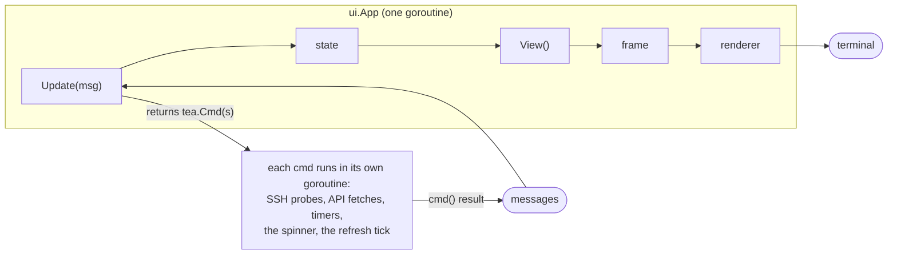
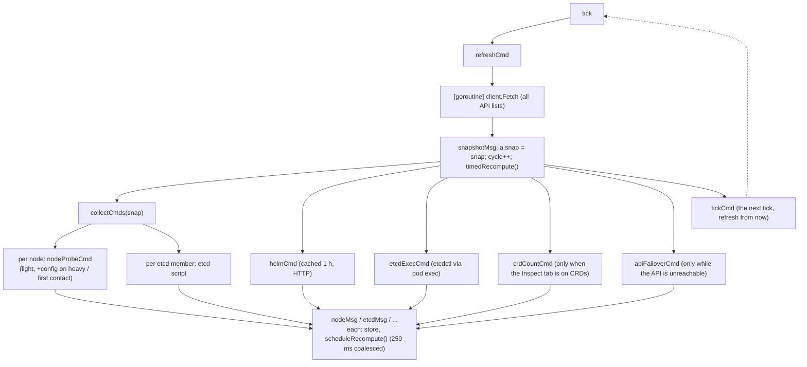

# Architecture: the update loop, the tick and what a screen costs

khealth is a Bubble Tea program: one goroutine owns the model (`ui.App`), everything else talks to it through messages. This document describes how that loop is driven today (the refresh tick, the probes it fans out, the recompute, the render), what each part costs, where it does more work than the screen in front of the operator needs, and the design for making collection follow the visible tab instead of running everything every tick. [REFRESH.md](REFRESH.md) lists every remote call and its cadence; [PERFORMANCE.md](PERFORMANCE.md) has the measured numbers.

## 1. The loop



- `Update` is the only place state changes. It must be fast: while it runs, nothing is painted and keys queue up.
- Every `tea.Cmd` returned from `Update` runs in its own goroutine and comes back as one message. A probe never touches the model; it returns a `nodeMsg` / `etcdMsg` / `stigStageMsg` carrying a parsed result, and the handler stores it.
- `View` is called after every `Update` - including after the spinner's 12 ticks per second - and must return the whole screen as one string. The renderer diffs it against the previous frame line by line (see §5).

### Messages and their guards

| Message | Produced by | Guard |
|---|---|---|
| `tickMsg{seq}` | `tickCmd`, armed after every snapshot, fires after `refresh` (30 s) | `seq == a.seq && !refreshing` - a tick armed by a superseded refresh (`r`, `R`, context switch) is dropped |
| `snapshotMsg{seq, snap}` | `refreshCmd`: the API fetch (`k8s.Client.Fetch`) | `seq == a.seq` |
| `nodeMsg{gen, info, opts, logSum}` | `nodeProbeCmd`: one SSH script per node | `gen == a.gen` |
| `etcdMsg{gen, probe}` | `collectCmds`: etcd script on etcd nodes | `gen == a.gen` |
| `etcdExecMsg{gen}` | `etcdExecCmd`: etcdctl inside the etcd pod (API exec) | `gen == a.gen` |
| `stigStageMsg{gen, node, stage}` | `stigStageCmd`: one Shift+S collection stage | `gen == a.gen` and the scan still wants the node |
| `s3CheckMsg`, `crdCountMsg`, `helmMsg`, `apiFailoverMsg` | on demand / per cycle | `gen` or `seq` as noted in the code |
| `recomputeMsg` | `scheduleRecompute`: a 250 ms timer | none - coalesces a burst |
| `spinner.TickMsg` | the spinner, 12/s, forever | none |
| `tea.KeyMsg`, `tea.WindowSizeMsg` | the terminal | - |

Two counters guard stale answers, and they mean different things:

- **`seq`** numbers one refresh. `refreshCmd` increments it, so a tick or a snapshot from a refresh that was superseded is ignored. It moves every 30 s.
- **`gen`** numbers the cluster the app is attached to. Only a context switch increments it. Probe answers carry `gen`, not `seq`: a probe that straddles a tick (a 20 s STIG stage, a slow node) must still land. Using `seq` here was the bug that hung the security scan - the answer was dropped, `a.pending[node]` stayed set, and `skipProbe` refused to probe the node ever again.

## 2. One refresh cycle today



Facts that matter for the design:

- The tick is armed **after** the snapshot lands, so a cycle is `refresh` plus the API round trip; probes run inside that window.
- `collectCmds` probes **every node** every cycle regardless of the tab. Skips: a node whose previous probe is still running (`a.pending`), and backoff (`ssh.backoff`: a probe that took more than `refresh/2` skips the next cycle).
- Heavy cycles (`heavy_every` = every 6th, `R`, first contact, SSH re-enabled) add the journal, `crictl images`, tarball manifests and PV `du` to the light probe, and the config tier (certs, sysctls, config files, slow hardening commands). Between heavy cycles `Info.MergeHeavy` / `MergeConfig` carry the previous results forward.
- The OS STIG facts are **not** part of any cycle: Shift+S runs its own staged probes (§3).

### What a cycle costs (3-node RKE2 lab, `refresh` 30 s)

| Part | Where | Cost |
|---|---|---|
| API snapshot | apiserver | 47 requests, 2.4 MB, ~0.4 s wall, 0.8 s local CPU (protobuf + watch cache on) |
| Light probe | each node, every cycle | ~0.6 s wall, 0.4 s remote CPU, 6 KB |
| etcd probe | each etcd node, every cycle | ~1 s wall, 0.6 s remote CPU, 5 KB |
| etcd exec | one etcd pod, every cycle | 4 exec round trips |
| Heavy + config probe | each node, every 6th cycle | ~14 s wall, 8.8 s remote CPU, 600 KB (with STIG facts; the sweep and `rpm -qa` dominate) |
| STIG scan | each node, Shift+S only | 4 stages, ~12 s wall per node, ~9 s remote CPU |
| `recompute` | local, every snapshot + every message burst | 0.4 ms (STIG evaluation + checks); **was 1.8 s** while it re-classified every journal, see §4 |
| `View` | local, 12/s + every key | 0.5 ms from the frame cache; 5-10 ms when a tab is rebuilt (Security OS STIG, Logs lines) |

## 3. The security scan: a probe that is not on the tick

`startScan` builds a `secScan` and starts stage 0 on every target node. Each `stigStageMsg` merges the stage's sections into `sc.facts[node]` (`nodeinfo.ParseSTIGStage`) and starts the next stage; the last one hands the facts to the node's `Info` (`AdoptSTIG`). The scan owns its timeouts (3 x `ssh.timeout`, 6 x for the filesystem sweep), never consults `a.pending` or the backoff, and its answers are guarded by `gen`, so a refresh tick cannot lose them. This is the model for any collection that a tab asks for: **the tab starts it, the tab tracks it, the tick does not.**

## 4. Recompute

`recompute` re-derives what the screens show from the collected data: `stig.Evaluate` (when the Security tab was opted in), `checks.Evaluate` (the findings) and the finding history. It runs synchronously in `Update` after every snapshot, and 250 ms after the last message of a burst (`scheduleRecompute` coalesces the N node + N etcd answers of a cycle into one). It is cheap now (0.4 ms on three nodes) because it no longer runs log classification: `logs.ClassifySources` costs ~0.5 ms per line through the knowledge base (95 regexes, several of them backtracking), so three nodes' 1,200-line journals were 1.8 s of UI-goroutine time on **every** recompute - several times per cycle - although a journal only changes when a heavy probe lands. A journal is now classified once, in the probe goroutine that fetched it (`classifyLogs` in `nodeProbeCmd`), and the summary rides on the `nodeMsg`.

The rule this establishes: **derive in the goroutine that fetched the input, or cache by input identity; `Update` only stores and routes.**

## 5. Rendering

`View` builds header, tab strip, sub-tab strip, the body of the current tab, the status line, and overlays; `fitScreen` makes it exactly `height` lines of at most `width` cells. The body comes from `currentContent()`:

- **Only the current tab is built.** Every tab's builder reads the shared state (`a.snap`, `a.nodes`, `a.etcd`, `a.logSum`, `a.stigRes`, ...) and returns a `content` (header lines + rows); nothing is pre-rendered for other tabs.
- **The frame cache** (`frameCache`) serves the last build again while the frame is *hot* - the last message was a spinner tick or a cursor key (j/k, PgUp/PgDn, g/G) - and it is under a second old (so "N s ago" texts keep moving). Any other message marks the frame cold and the next `View` rebuilds. Hotness is decided **after** a message is handled, never at build time: a key handler that reads the content before changing state (Enter on the Logs tab) must not leave a stale frame. Building the Logs lines view is 68 ms (regex highlighting of every line, ANSI-aware width of every cell); at 12 spinner ticks a second that was 80 % of a core while idle, and 147 ms per j/k press.
- **The renderer** (Bubble Tea's standard renderer, alt screen, ≤60 fps) writes only the lines that changed, appends erase-to-end-of-line to each of them and erases below the frame when it shrinks. So a tab switch is painted once. `tea.ClearScreen` is sent only when an overlay opens or closes or the inspector changes depth: it writes `ESC[2J` *after* the new frame was flushed and forces a second full paint, which on the wide, heavily colored Security tables read as lag.

## 6. Where the loop still does more than the screen needs

1. **Every node is probed every cycle for every tier the cycle allows**, whether or not any open tab shows the result. The heavy tier in particular (journal, images, tarballs, PV `du`: ~600 KB and seconds of remote CPU per node) feeds the Logs, Images and Storage tabs and a handful of findings, yet runs on every 6th cycle on every node even when the operator sits on Overview all day.
2. **The config tier** rides on the heavy cycle for the same reason, though nothing on it changes between reboots.
3. **The etcd exec probe** (4 execs per cycle) runs whether or not the etcd tab or an etcd finding needs the member view that cycle.
4. **`stig.Evaluate`** runs on every recompute once the Security tab was opted in, across all nodes' ~450 rules, though only that tab and one finding read it.
5. **Findings are recomputed after every message burst**, so a node answering 2 s after the snapshot triggers `checks.Evaluate` again for data the operator may never look at until the next tick anyway.

What is *not* spam: the API snapshot, the light probe and the etcd probe. The header, Overview and the findings - the reason the tool runs in the background - are made of them, and they are cheap by design (REFRESH.md).

## 7. Design: collection follows the visible tab

*Implemented 2026-09-20 (`internal/ui/collect.go`): tiers `journal`, `images`, `pv`, `config`, `etcd-exec`; `tabNeeds` / `collect.always` / the journal floor decide per node in `collectCmds`; `onEnter` fires stale tiers when a tab opens; every tier-showing tab prints its age; `stigRes` recomputes under a dirty flag. Two departures from the text below: the Addons tab also wants `images` (its registries table shows the pull dry run), and the config tier keeps the `heavy_every` cadence while RKE2 or Security stays open rather than "never again". While validating it a pre-existing bug surfaced: `ausearch` reads events from stdin when stdin is a pipe, so the FAPDENY section had been swallowing the rest of every heavy probe fed over `sh -s` (`--input-logs </dev/null` now).*

### 7.1 Tiers and who needs them

Split collection into tiers a tab can declare a need for. The light tiers stay unconditional; the heavy ones become **demand tiers**.

| Tier | Script / call | Feeds | Cadence today | Cadence proposed |
|---|---|---|---|---|
| `api` | `client.Fetch` | everything | every tick | every tick (unchanged) |
| `light` | base.sh light part + preflight | header, Overview, Nodes, findings | every tick | every tick (unchanged) |
| `etcd` | etcd.sh | etcd tab, findings | every tick | every tick (unchanged; it is 0.1 s CPU) |
| `etcd-exec` | etcdctl via exec | etcd tab member view, quorum findings | every tick | every tick on servers with ≤ 5 members; otherwise etcd tab open or a quorum finding pending |
| `config` | base.sh `__CONFIG__` block | RKE2 tab, Security hardening, STIG cluster rules, findings on certs/sysctls | heavy cycle | first contact, `R`, and when the RKE2 or Security tab is opened with facts older than `heavy_every` cycles |
| `journal` | heavy.sh journal + log files | Logs tab, log findings | heavy cycle | Logs tab open: every `heavy_every`; otherwise once per **hour** for the log findings, or `R` |
| `images` | heavy.sh `crictl images` + tarballs, preflight.sh `REGPULL` (`crictl pull` dry run per registry) | Images tab, image findings, preflight registry rows | heavy cycle | Images tab open, `R` |
| `pv` | heavy.sh `du` of hostPath PVs | Storage tab | heavy cycle | Storage tab open, `R` |
| `stig` | 4 scan stages | Security OS STIG | Shift+S | Shift+S (unchanged) |
| `crd` | CRD instance counts | Inspect on CRDs | Inspect on CRDs (already tab-gated) | unchanged - this is the pattern |
| `helm` | repo indexes / Artifact Hub | Helm tab, addon findings | per snapshot, cached 1 h | unchanged (cache does the work) |

`nodeinfo.Options` already carries per-kind flags (`Heavy`, `Config`, `OSStig`, `CPUSample`); `Heavy` becomes three flags (`Journal`, `Images`, `PVs`) and heavy.sh three `__X__`-guarded blocks, the way base.sh guards its config tier with `__CONFIG__` today.

### 7.2 The need set

```go
// what the visible tab wants kept fresh
func (a *App) tabNeeds() needs {
	n := needs{}
	switch a.tab {
	case tabLogs:     n.journal = true
	case tabImages:   n.images = true
	case tabStorage:  n.pv = true
	case tabRKE2, tabSecurity: n.config = true
	case tabEtcd:     n.etcdExec = true
	}
	return n
}
```

`collectCmds` computes `want := a.tabNeeds() ∪ always ∪ background(cycle) ∪ {R pressed}` and sets the per-node `Options` from it.

**`always` - what keeps gathering on every tab.** Timelines only work if their samples never stop: the CPU / memory / load / disk sparklines on Overview and Nodes, the etcd latency series and the error-per-hour histogram are only as continuous as their collection. So:

- The light tier and the etcd probe are always on and not configurable: they carry the per-node CPU/memory/load/disk samples (`series` in `widgets.go`, recorded by `recordNode` / `recordEtcd` / `recordSnapshot` every cycle) that every timeline reads. Leaving the Nodes tab for an hour and coming back must show the hour, not a gap.
- Demand tiers can be pinned to always-on by configuration, for the operator who wants the log timeline or image inventory continuous:

  ```yaml
  collect:
    always: [journal]        # journal | images | pv | config | etcd-exec
    journal_background: 1h   # the floor for tiers not pinned and not on screen
  ```

  A pinned tier follows its own cadence (journal every `heavy_every` cycles) on every tab, exactly as the heavy cycle does today - so `collect.always: [journal, images, pv, config, etcd-exec]` is today's behavior, and the default (`[]`) is the tab-driven one.

`background(cycle)` is the slow floor for tiers neither pinned nor on screen, so findings stay honest when nobody is looking: journal every `journal_background` (default 1 h), config on first contact, nothing else.

### 7.3 On-enter fetch (the CRD pattern, generalized)

Opening a tab whose tier is stale must not wait for the next tick. The Inspect tab already does this: switching to CRDs fires `crdCountCmd` at once. Generalize it: `setTab` / `setSub` call `a.onEnter()`, which for each tier the new tab needs checks staleness (a new `Info.JournalAt`, `ConfigProbed` + cycle, `STIGCollected`) and fires the probe immediately when the facts are missing or older than the tier's freshness. The tab shows the age of what it has ("journal from 4 min ago · collecting") the way the OS STIG header does today, so a stale view is visible, never silent.

While the tab stays open the tick keeps the tier fresh at the tier's own cadence (journal every `heavy_every` cycles, config never again unless `R`). Leaving the tab stops it; the data stays and is carried forward by the `Merge*` functions as now.

### 7.4 Recompute by input

Give each derived product a dirty flag set by the message that changes its input, and recompute only the dirty ones:

| Product | Inputs | Dirty on |
|---|---|---|
| `logSum[node]` | journal, log files | heavy probe with a journal (already: computed in the probe goroutine) |
| `stigRes` | snap, nodes' config + STIG facts, etcd | snapshot; node probe with config or STIG facts; STIG stage completion |
| `findings` | everything above | any of the above, coalesced 250 ms |

`checks.Evaluate` stays the one coalesced call per burst; `stig.Evaluate` moves under its own flag so a light probe answering does not re-evaluate 1,300 rules. The frame cache already makes rendering follow the same rule.

### 7.5 Invariants

1. `Update` stores and routes; it never fetches, parses a large payload or classifies. Anything above a millisecond happens in a `tea.Cmd`.
2. Probe answers are guarded by `gen`, never by `seq`.
3. A tier is collected because a tab needs it now, `R` asked for it, or the background floor is due - one of the three, and the perf log records which (`ProbeRecord.Kind`).
4. Every view that shows a demand tier shows its age.
5. `View` for a hot frame is served from the cache; a cold frame builds only the current tab.

### 7.6 Migration, in order

1. Split `Options.Heavy` into `Journal`, `Images`, `PVs`; guard heavy.sh; record each as its own probe kind. No behavior change yet.
2. Add `tabNeeds`, `collect.always` and `background`; make `collectCmds` set the flags from it. Default `background`: journal hourly, so the log findings keep working for an operator parked on Overview.
3. Add `onEnter` with staleness checks and the "from N ago · collecting" line on Logs, Images, Storage, RKE2, Security hardening.
4. Gate `etcdExecCmd` on the etcd tab / pending quorum finding.
5. Dirty flags for `stigRes`.
6. Re-run `tools/perfbench -cycles 10` and compare with the table in PERFORMANCE.md: the steady-state share of a core per node should drop to the light + etcd probes alone (~2 %), and the heavy probe should appear only in cycles where a tab asked for it.

## 8. Measuring

- `tools/perfbench`: headless cycles, remote CPU per probe kind, `-monitor` samples the nodes from a second SSH session (PERFORMANCE.md).
- `tools/scandrive`: runs the real `ui.App` update loop headlessly against a cluster, presses keys on a timer, logs every message with the header line, and times sub-tab switches - the way the scan hang and the sub-tab lag were reproduced.
- `go test ./internal/ui -bench .`: `BenchmarkLogsLinesSpinnerTick`, `BenchmarkLogsLinesCursorDown`, `BenchmarkSecuritySubTabSwitch`, `BenchmarkRecompute` - the local costs in §2, with a `-cpuprofile` when one of them moves.
- `P` in the TUI and `--perf-log`: what the last cycles cost the API server, each node and this host, per probe kind.

## 9. Repository layout

```
cmd/khealth            entry point
internal/config        defaults, YAML file, flags
internal/k8s           client-go snapshot, Helm decoding, helpers
internal/sshrun        SSH runner (agent/key/password, bastion, become: sudo/dzdo/doas, known_hosts)
internal/nodeinfo      node collection script + parser (resources, perms, registries, images, logs)
internal/etcd          etcd probe script + parser (config source, health, metrics, etcdctl, snapshots)
internal/rescue        etcd rescue over SSH: rejoin one server / restore a snapshot (RESCUE.md), step plan + scripts
internal/logs          log pattern knowledge base + classifier
internal/stig          STIG/CIS rule engine (one file per reference: kubernetes, rke2, rancher, cis, os + rhel/ubuntu tables)
internal/nodeinfo/scripts, internal/etcd/scripts, internal/rescue/scripts
                       the POSIX sh probes sent over SSH, embedded with //go:embed (edit the .sh, not Go)
internal/stigdata      generated OS STIG tables (DISA XCCDF x ComplianceAsCode) + the probe fragment derived from them
tools/stiggen          generator for internal/stigdata/data (see STIG.md)
internal/helmcheck     chart update lookup (repo index.yaml from your helm repos / helm.repos)
internal/checks        findings engine (thresholds -> CRIT/WARN/INFO)
internal/ui            Bubble Tea app, tabs, detail views
```

